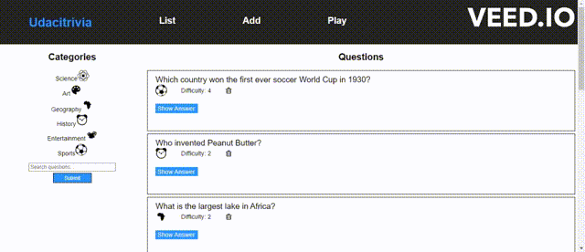

# Full Stack Trivia App

Udacity is invested in creating bonding experiences for its employees and students. A bunch of team members got the idea to hold trivia on a regular basis and created a webpage to manage the trivia app and play the game, but their API experience is limited and still needs to be built out.

The application allows the following:

1. Display questions - both all questions and by category. Questions should show the question, category and difficulty rating by default and can show/hide the answer.
2. Delete questions.
3. Add questions and require that they include question and answer text.
4. Search for questions based on a text query string.
5. Play the quiz game, randomizing either all questions or within a specific category.

### Demo




## Getting Started

This project makes use of **ReactJS** and **Node** for the frontend and **Flask**, **SQLAlchemy** and **PostgreSQL** for the backend. To be able to run this project locally, all aforementioned packages/libraries must be installed first.


### Installing Dependencies for the Backend

1. **Python 3.7** - Follow instructions to install the latest version of python for your platform in the [python docs](https://docs.python.org/3/using/unix.html#getting-and-installing-the-latest-version-of-python)


2. **Virtual Enviornment** - We recommend working within a virtual environment whenever using Python for projects. This keeps your dependencies for each project separate and organaized. Instructions for setting up a virual enviornment for your platform can be found in the [python docs](https://packaging.python.org/guides/installing-using-pip-and-virtual-environments/)


3. **PIP Dependencies** - Once you have your virtual environment setup and running, install dependencies by naviging to the `/backend` directory and running:
```
pip install -r requirements.txt
```
This will install all of the required packages we selected within the `requirements.txt` file.

4. **Key Dependencies**
 - [Flask](http://flask.pocoo.org/)  is a lightweight backend microservices framework. Flask is required to handle requests and responses.

 - [SQLAlchemy](https://www.sqlalchemy.org/) is the Python SQL toolkit and ORM we'll use handle the lightweight sqlite database. You'll primarily work in app.py and can reference models.py.

 - [Flask-CORS](https://flask-cors.readthedocs.io/en/latest/#) is the extension we'll use to handle cross origin requests from our frontend server.

### Database Setup
With Postgres running, restore a database using the trivia.psql file provided. From the backend folder in terminal run:
```bash
psql trivia < trivia.psql
```

### Running the server

- From within the `backend` directory after making sure you are working using your created virtual environment, run the server with the following command:
  ```
      export FLASK_APP=flaskr
      export FLASK_ENV=development
      flask run
  ```
  Setting the `FLASK_ENV` variable to `development` will detect file changes and restart the server automatically. Setting the `FLASK_APP` variable to `flaskr` directs flask to use the `flaskr` directory and the `__init__.py` file to find the application.

#### Testing

To run the tests, run:

```
    dropdb udacity_trivia_test
    createdb udacity_trivia_test
    psql udacity_trivia_test < trivia.psql
    python test_flaskr.py
```

This will populate the test database with data.


### Frontend

> _tip_: this frontend is designed to work with [Flask-based Backend](../backend). It is recommended you stand up the backend first, test using Postman or curl, then the frontend should integrate smoothly.

### Installing Dependencies

1. **Installing Node and NPM**<br>
This project depends on Nodejs and Node Package Manager (NPM). Before continuing, you must download and install Node (the download includes NPM) from [https://nodejs.com/en/download](https://nodejs.org/en/download/).

2. **Installing project dependencies**<br>
This project uses NPM to manage software dependencies. NPM Relies on the package.json file located in the `frontend` directory of this repository. After cloning, open your terminal and run:
```bash
npm install
```
>_tip_: **npm i** is shorthand for **npm install**


### Running Your Frontend in Dev Mode

The frontend app was built using create-react-app. In order to run the app in development mode use ```npm start```. You can change the script in the ```package.json``` file.

Open [http://localhost:3000](http://localhost:3000) to view it in the browser. The page will reload if you make edits.<br>

```bash
npm start
```

## API Reference

[View the README.md in the backend folder for the API documentation](./backend/README.md)

## Author

- Opeyemi Odebode

## Acknowledgement

- The entire Udacity team!
